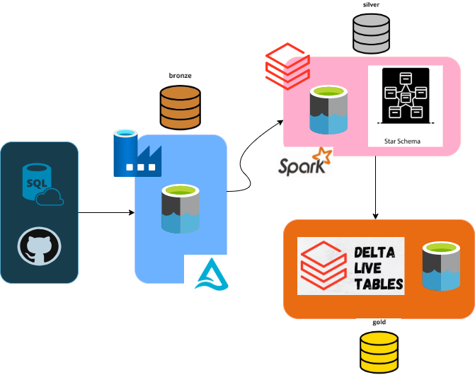

# Data Lakehouse Medallion Architecture - Spotify Data Project
This project implements a Medallion Architecture using Azure Data Lake Storage Gen2, Azure Data Factory, Azure Databricks, and Delta Lake to build a scalable, governed, and reliable data platform for Spotify analytics. The architecture is structured into Bronze, Silver, and Gold layers, each serving distinct roles in the data pipeline.

## Bronze Layer

- Purpose: Captures raw data exactly as received from the source, acting as the system of record.

- Storage: Data Lake Gen2 with a dedicated `bronze` container holding raw JSON files.

- Resource Organization:
    - Resource Group created to manage Azure services (Data Lake, SQL Database, Data Factory).
    - Azure SQL Database hosts source tables (dimensions and facts) created via SQL scripts.
    - Linked services securely connect ADF with SQL Database (source) and Data Lake (sink).

- Pipeline Logic:
    - Handles both backfill and incremental CDC loads.
    - Uses watermarking to detect new data.
    - Skips processing if no new data detected.

- Failure Management: Centralized alerting ensures operational reliability.

## Silver Layer

- Purpose: Cleans, structures, and governs the raw data into high-quality, structured Delta tables ready for consumption.

- Platform: Azure Databricks with Unity Catalog for centralized governance, security, and access control.

- Storage: Delta Lake tables stored in the silver container within ADLS Gen2.

- Data Processing:
    - Uses Spark Structured Streaming combined with Auto Loader for incremental, idempotent ingestion from Bronze Parquet files.
    - Auto Loader ensures fault tolerance, schema evolution, and exactly-once semantics using checkpointing.
    - Custom reusable transformation logic handles cleaning, deduplication, and enrichment of dimension and fact data.

- Security:
    - Azure Managed Identity and Access Connector enable secure data lake access.
    - Managed Identity assigned Storage Blob Data Contributor role on the ADLS Gen2 storage account.

- Governance:
    - Unity Catalog organizes data into a catalog (spotify_cata) and schema (silver).
    - External credentials and locations control access to Bronze, Silver, and Gold containers.

- Dynamic SQL Generation: Uses Jinja2 templating in Python notebooks to generate flexible, parameterized SQL for complex joins and aggregations, particularly in preparation for Gold Layer models.

## Gold Layer

- Purpose: Produces curated, consumption-ready data models optimized for analytics and reporting, including historical tracking via Slowly Changing Dimensions (SCDs).

- Framework: Built on Databricks Delta Live Tables (DLT) for declarative pipeline management and automated orchestration.

- Storage: Delta Lake tables stored in the gold container.

- Key Features:
    - Supports SCD Type 1 (overwrite changes) and SCD Type 2 (historical versioning) for dimension tables.
    - Implements CDC flows automatically with quality checks to ensure data integrity.
    - DLT manages cluster scaling and pipeline dependencies, minimizing operational overhead.

- Pipeline Design:
    - Defined as a declarative DLT pipeline (gold_pipeline) following Lakeflow conventions.
    - Integrates data from Silver Layer tables as streaming inputs for incremental updates.

- Benefits:
    - Enables accurate historical data tracking and auditability for business users.
    - Simplifies complex CDC merge logic into reusable, manageable pipeline constructs.
    - Validated via querying of dimension tables showing multiple historical versions.
    - Visualized with Databricks-generated DAG for transparent execution and dependency management.

## Key Technologies and Services

- Azure Data Lake Storage Gen2: Scalable, secure storage layer following Medallion Architecture containers.

- Azure SQL Database: Source system hosting dimension and fact tables.

- Azure Data Factory: Orchestrates data ingestion pipelines, including CDC logic, parameterization, and failure alerts.

- Azure Databricks: Performs streaming data processing, transformations, and pipeline orchestration with Delta Lake and Delta Live Tables.

- Unity Catalog: Provides centralized governance, security, and access control for data assets.

- Delta Lake: Ensures ACID transactions, schema enforcement, and versioned data storage.

- Databricks Delta Live Tables: Declarative framework for building scalable, automated CDC-enabled pipelines with SCD support.

## Project Overall Architecture



## Repository Structure
```
spotify-analytics-on-azure/
│
├── bronze_layer/                            
│   ├── bronze_setup.md                 # read_me file which provides comprehensive details about the implementation of bronze layer
│   ├── initial_load.sql                # initial sql query of the data load
│
├── silver_layer/                  
│   ├── silver_seup.md/                 # read_me file which includes all the details about the silver layer
│
├── gold_layer/                  
│   ├── gold_seup.md/                   # read_me file in which there are present all the insights regarding the creation of gold layer
│
├── images/                             # folder which contains all the images that are present in the read_me files
│
├── README.md                           # Project overview and instructions
└── spotify_project_architecture.png    # image which describes the whole workflow of the project
```
---


