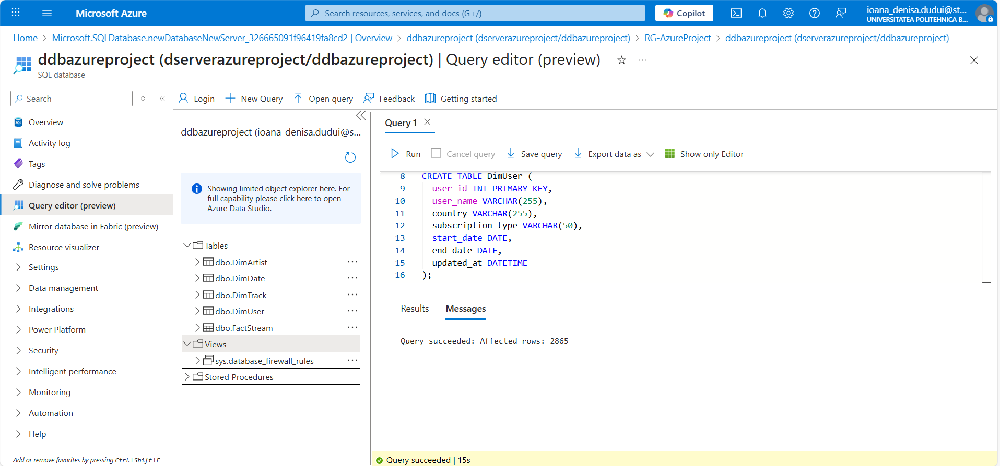
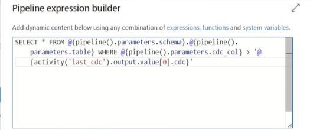

# Data Ingestion Setup

## Overview
The **Bronze layer** is responsible for ingesting raw data from the **Azure SQL Database** into **Azure Data Lake Storage Gen2**.  
This layer ensures that data is captured in its original form and supports both **initial backfilling** and **incremental loading** for optimized performance and storage usage.

---

## Resource Group Creation
To organize all related Azure services, I first created a **Resource Group** dedicated to this project.

- it manages services like the Data Lake, SQL Database, and Data Factory.

---

## Azure Data Lake Setup
Within the Resource Group, I created an **Azure Data Lake Storage Gen2** account.  
Inside this storage account, I defined **three containers** to implement the Medallion architecture:

| Container | Purpose |
|------------|----------|
| **bronze** | Stores raw ingested data directly from the source |
| **silver** | Contains cleaned and processed data |
| **gold**   | Holds curated and analytics-ready data models |

---

## Azure Data Factory Setup
Next, I created an **Azure Data Factory** instance in the same Resource Group.  
ADF is used to orchestrate and automate the data movement between the SQL source and the Data Lake.

Main components configured:
- **Pipelines:** Define the data movement logic (backfill + incremental).
- **Linked Services:** Connect ADF securely to source and destination systems.
- **Datasets:** Represent input/output data locations.
- **Parameters:** Enable dynamic, metadata-driven pipeline execution.

---

## Azure SQL Database & Server Setup
Created an **Azure SQL Database** and an associated **SQL Server** to host my source data.  

To initialize the database schema, I executed the `initial_load.sql` script (available in this repo) which creates the necessary tables, including:  
- Four dimension tables: `DimUser`, `DimTrack`, `DimDate`, `DimArtist`
- One fact table: `FactStream`

These tables store subscription and streaming information, which form the foundation of the analytical model.



---

## Linked Services Configuration
To enable data movement between ADF and the other Azure services, I configured two **Linked Services**:

1. **Azure SQL Database Linked Service**
   - Allows ADF to read data from the SQL source.

2. **Azure Data Lake Linked Service**
   - Enables ADF to write ingested data into the Data Lake’s Bronze container.

---

## Dynamic Incremental and Backfill Pipeline
I built an ADF **pipeline** to perform both **initial backfill** and **incremental loading** from Azure SQL Database into the Bronze layer.

## Incremental Ingestion Pipeline Design

The **Incremental_Ingestion** pipeline is designed to move data from the Azure SQL Database to the Data Lake's bronze container, efficiently handling both the initial full load and subsequent incremental (CDC - Change Data Capture) loads.  
The pipeline is fully metadata-driven using parameters, making it reusable for any dimension or fact table in the source database.


---

## Description of Pipeline Activities

The activities are executed sequentially based on successful completion and are detailed below in their order of operation:

1. `last_cdc` (Lookup Activity)
- Purpose: This activity retrieves the last recorded high-watermark value used in the previous incremental load.

- Mechanism: It performs a file fetch operation, specifically reading the content of the `cdc.json` file.

- Output: The output of this activity (e.g., `1900-01-01` or a previous timestamp) is passed to the main copy activity (`AzureSQLToLake`) to dynamically construct the `WHERE` clause for filtering source data.

2. `current` (Set Variable Activity)
- Purpose: This activity establishes the new high-watermark value for the current load.

- Mechanism: It assigns a pipeline variable with the current system timestamp at the start of the pipeline run.

- Why it's needed: This value represents the "now" up to which the data is being loaded. This is the value that will be written back to the `cdc.json` file once the data movement is complete, setting the starting point for the next pipeline run.

3. `AzureSQLToLake` (Copy Data Activity)
- Purpose: This is the core data movement activity, responsible for extracting and loading the incremental changes.

- Source: Azure SQL Database. The source query is dynamic and uses the watermark value retrieved by the `last_cdc` activity 

- Sink: Data Lake (using the dynamically parameterized datasets `json_dynamic` , `parquet_dynamic`).

- Function: Moves the filtered, incremental data from the SQL table to the specified file path in the Data Lake.

### Watermark Update Activities (Post-Load)
Once the AzureSQLToLake activity successfully completes, the pipeline proceeds to update the high-watermark for future runs.

4. `max_cdc` (Script Activity)
- Purpose: To retrieve the actual maximum CDC value from the data just copied to the data lake (or, alternatively, the maximum value from the source table up to the current time).

- Mechanism: The activity is used to run a SQL query that determines the high-watermark.

- Output: The single maximum value which will serve as the next stable watermark.


5. `update_last_cdc` (Copy Data Activity)
- Purpose: To persist the new high-watermark for the next pipeline execution.

- Source: The output of the `max_cdc` activity.

- Sink: The `cdc.json` file that was read by the `last_cdc` activity.

- Function: It overwrites the contents of the `cdc.json` file with the new, confirmed maximum CDC value, ensuring the next run starts from this point. This completes the incremental loop.

## CDC Metadata Setup

To enable incremental data ingestion, I first created a **CDC (Change Data Capture) tracking file** named `cdc.json`.  
This file maintains the last processed timestamp, ensuring that each subsequent pipeline run only ingests new or updated records.

### Pipeline Parameters:
The pipeline uses dynamic parameters to avoid hardcoding table names:
- `@schema`: The source table schema name (e.g., `dbo`).
- `@table`: The source table name (e.g., `DimUser`).
- `@cdc_col`: The name of the CDC column (e.g., `updated_at`).

### Creating the cdc.json File

- I created a JSON file called `cdc.json` containing key-value pairs to store the CDC state.
- The initial value is set to a minimal date to perform a **full historical load** on the first pipeline execution:

  ```json
  {"cdc": "1900-01-01"}

### Defining the Initial Load Query

After creating the `cdc.json` file, I wrote an SQL query to fetch all data from the Azure SQL Database during the first full load.
The query dynamically filters data based on the CDC value from the JSON file.



### Parquet Dynamic Dataset (parquet_dynamic)

The `parquet_dynamic` dataset is configured for writing and reading data in the highly optimized Parquet format. It is primarily used for creating structured data within the Silver and Gold layers of the data lake.

- **Dataset Parameters**:
The file path components(`@container` , `@folder` , `@file`) are supplied dynamically when the dataset is called by an activity (e.g., Copy Data or Data Flow):


- **Usage**:
This dataset is used as a sink when data is moved from the raw zone and converted into a highly performant columnar format.

### JSON Dynamic Dataset (json_dynamic)

The `json_dynamic` dataset is configured specifically for handling JSON files. This is used for ingesting raw, schema-flexible data into the data lake's Bronze layer.

- **Dataset Parameters**:
The file path components(`@container` , `@folder` , `@file`) are passed dynamically by the consuming pipeline activity:


- **Usage**:
This dataset is used as a source to read raw, unstructured, or semi-structured data immediately after ingestion.

---
