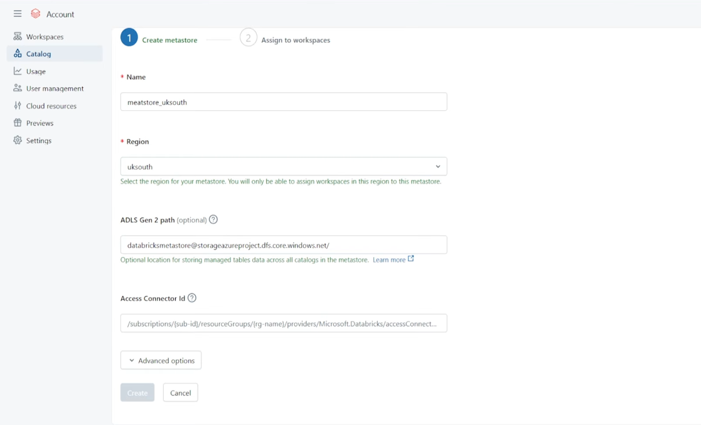
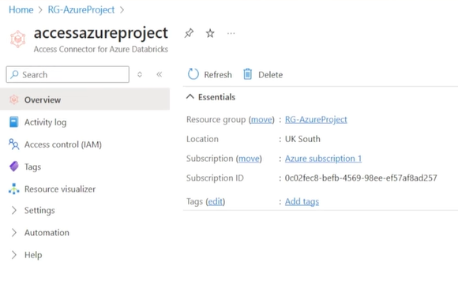

# Silver Layer Overview

## Key Function

The Silver Layer is responsible for refining raw data ingested from the Bronze Layer into clean, structured, and governed tables.

## Description

This layer is built entirely on Azure Databricks and features two key components:

  - **Data Governance** : Implemented using Unity Catalog (including metastores, credentials, and external locations) for centralized access control and enhanced security.

  - **Data Processing** : Utilizes Spark Structured Streaming with Auto Loader to create robust, fault-tolerant, and metadriven ingestion pipelines that automatically handle schema evolution and incremental updates.

## Unity Catalog Security Configuration

To enable Unity Catalog to access data in the Azure Data Lake, a secure, role-based access method was implemented using an Azure Managed Identity and an Access Connector.

1. Unity Metastore and Storage Account
  - The foundation of governance begins with the Unity Metastore, which stores all metadata and access rules.

  - A Storage Account was created to act as the root storage for the Metastore's system and governance data.

2. Creating the Access Connector
  - The Access Connector acts as the secure intermediary between Databricks and the Data Lake.

  - A dedicated Azure resource, named `accessazureproject` (a Databricks Access Connector), was created.This resource automatically provisions an Azure Managed Identity.

3. Granting Data Lake Access (Role Assignment)
  - The Managed Identity created needs specific permission on the Data Lake to read the Bronze layer and write to the Silver layer.

  - Target Resource: ADLS Gen2 account.

  - Role Assignment: The Managed Identity associated with the `accessazureproject` connector was granted the Storage Blob Data Contributor role.

  - Result: This role assignment allows the Managed Identity to read, write, and delete blobs within the data lake, securely granting Databricks access to the Bronze data.
