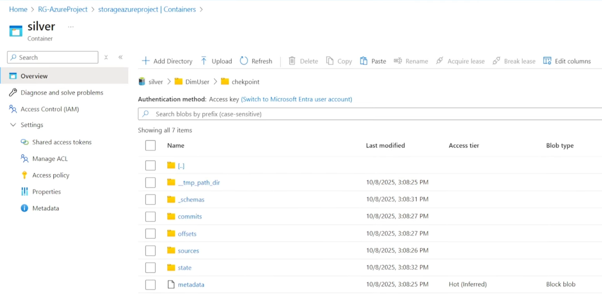

# Silver Layer Overview

## Key Function

The Silver Layer is responsible for refining raw data ingested from the Bronze Layer into clean, structured, and governed tables.

## Description

This layer is built entirely on Azure Databricks and features two key components:

  - **Data Governance** : Implemented using Unity Catalog (including metastores, credentials, and external locations) for centralized access control and enhanced security.

  - **Data Processing** : Utilizes Spark Structured Streaming with Auto Loader to create robust, fault-tolerant, and metadriven ingestion pipelines that automatically handle schema evolution and incremental updates.

## Unity Catalog Security Configuration

To enable Unity Catalog to access data in the Azure Data Lake, a secure, role-based access method was implemented using an Azure Managed Identity and an Access Connector.

1. Unity Metastore and Storage Account
  - The foundation of governance begins with the Unity Metastore, which stores all metadata and access rules.

  - A Storage Account was created to act as the root storage for the Metastore's system and governance data.


2. Creating the Access Connector
  - The Access Connector acts as the secure intermediary between Databricks and the Data Lake.

  - A dedicated Azure resource, named `accessazureproject` (a Databricks Access Connector), was created.This resource automatically provisions an Azure Managed Identity.


3. Granting Data Lake Access (Role Assignment)
  - The Managed Identity created needs specific permission on the Data Lake to read the Bronze layer and write to the Silver layer.

  - Target Resource: ADLS Gen2 account.

  - Role Assignment: The Managed Identity associated with the `accessazureproject` connector was granted the Storage Blob Data Contributor role.

  - Result: This role assignment allows the Managed Identity to read, write, and delete blobs within the data lake, securely granting Databricks access to the Bronze data.


## Unity Catalog Structure and Data Mapping

To establish proper data governance and separation of environments, a structured architecture was implemented in Unity Catalog, mapping logical catalogs and schemas to the physical storage containers in the Data Lake.

1. Catalog and Schema Definition

### Unity Catalog Components

| Component | Name | Purpose |
|------------|------|----------|
| **Catalog** | `spotify_cata` | The top-level logical container for the entire Spotify data domain. |
| **Schema** | `silver` | The specific logical container within the catalog for holding all clean, Silver Layer tables. |

2. External Credential
The security configuration established previously is formalized in Databricks as an External Credential.

- Credential Name: credential (This represents the `accessazureproject` Managed Identity Access Connector).

- Function: This credential allows Unity Catalog to securely assume the Managed Identity's permissions when accessing the Data Lake.

3. External Locations

External Locations map the secured credential to specific physical file paths in the Data Lake. These locations define the only permitted read/write paths for data processing.

| External Location | Purpose |
|------------|------|
| `bronze` | Read-only path for accessing raw data ingested by ADF. |
| `silver` | Write-path for storing the cleaned, refined Delta tables. |
| `gold` | Write-path for storing final aggregated reporting tables. |

4. Notebook Development Environment
- Workspace Folder: `SpotifyAzureProject`

- Processing: A dedicated notebook within this folder handles the dimension and fact table processing.

- Execution: The notebook is attached to a Serverless Cluster, utilizing Databricks' optimized and automatically managed compute environment for cost-efficient processing.

## Spark Structured Streaming and Auto Loader Implementation

The core ingestion mechanism in the Silver Layer uses Spark Structured Streaming combined with Databricks Auto Loader (`cloudFiles` format).

1. Idempotency through Auto Loader

The primary reason for selecting Auto Loader is its support for Idempotency—the guarantee that re-running the process with the same inputs will produce the same output state without creating duplicate records.

  - Mechanism: Auto Loader maintains an internal state store (backed by files in the checkpoint directory) to track every file it has processed from the Bronze source. When the streaming job restarts, it consults this list, ensuring it only ingests new files since the last successful run.

  - Efficiency: This approach is far more scalable than list-and-check methods, as it avoids listing large input directories repeatedly.

2. Dedicated Storage Structure

To manage the streaming process and store the Delta tables, a specific folder structure is implemented in the Silver container of the Data Lake for each target table (e.g  DimUser, DimTrack).

| Folder Name | Purpose |
|--------------|----------|
| `data` | This directory stores the actual data files for the Delta Lake table (e.g., `DimUser`). This is the path registered in Unity Catalog. |
| `checkpoint` | This is the critical folder used by Structured Streaming to store metadata about the stream's progress. |



3. The Checkpoint Folder's Role

The `checkpointLocation` option used in both the read and write streams is the key to idempotency and fault tolerance.

- **Read Stream** (`spark.readStream`): The `cloudFiles.schemaLocation` option specifies the checkpoint directory where Auto Loader tracks processed files to ensure no duplicates are read.

- **Write Stream** (`df.writeStream`): The `checkpointLocation` option stores the metadata that guarantees the exactly-once transaction logic of the stream write

## Silver Layer Transformation (Autoloader + Delta Lake)

The notebook implements using pySpark the Silver layer transformation in Azure Databricks, processing Parquet files from the Bronze container and writing clean, curated data into Delta tables stored in the Silver container.

Data is read incrementally using Autoloader, which detects new files automatically and supports schema evolution through `addNewColumns`.

- Used concepts and transformations:

| Concept                       | Description                                                                           |
| ----------------------------- | ------------------------------------------------------------------------------------- |
| **Autoloader**                | Incrementally loads new data files from Bronze layer as a stream.                     |
| **Structured Streaming**      | Processes data continuously and writes it in Delta format.                            |
| **Delta Lake**                | Ensures ACID transactions and schema evolution in Silver layer tables.                |
| **Reusable Transformations**  | Custom Python class for shared cleanup logic (`dropColumns`).                         |
| **Data Quality Enhancements** | Cleaning, deduplication, standardization (e.g., uppercase usernames, duration flags). |
| **Checkpointing**             | Maintains streaming state to avoid data reprocessing.                                 |

### transformations.py
```python
# ======================================================
# CUSTOM REUSABLE TRANSFORMATION CLASS
# ======================================================

class reusable:
    """
    Utility class to perform reusable DataFrame transformations(dropping unwanted columns across multiple datasets.)
    """

    def dropColumns(self, df, columns):
        """
        Drops a list of specified columns from a given DataFrame.
        """
        df = df.drop(*columns)
        return df
```

### DIMUSER

```python
# ======================================================
# READ DATA FROM BRONZE LAYER (STREAMING)
# ======================================================
df_user = (spark.readStream
    .format("cloudFiles")
    .option("cloudFiles.format", "parquet")
    .option("cloudFiles.schemaLocation", "abfss://silver@storageazureproject.dfs.core.windows.net/DimUser/checkpoint")
    .option("schemaEvolutionMode", "addNewColumns")
    .load("abfss://bronze@storageazureproject.dfs.core.windows.net/DimUser")
)

# ======================================================
# TRANSFORMATIONS
# ======================================================
from pyspark.sql.functions import *
from pyspark.sql.types import *

# Convert username to uppercase
df_user = df_user.withColumn("user_name", upper(col("user_name")))

# Use reusable transformation class
from spotify_dab.utils.transformations import reusable

df_user_obj = reusable()
# Drop unnecessary columns
df_user = df_user_obj.dropColumns(df_user, ['_rescued_data'])
# Remove duplicates based on user_id
df_user = df_user.dropDuplicates(['user_id'])

display(df_user)

# ======================================================
# WRITE TO SILVER LAYER (DELTA TABLE)
# ======================================================
(df_user.writeStream
    .format("delta")
    .outputMode("append")
    .option("checkpointLocation", "abfss://silver@storageazureproject.dfs.core.windows.net/DimUser/checkpoint")
    .trigger(once=True)
    .option("path", "abfss://silver@storageazureproject.dfs.core.windows.net/DimUser/data")
    .toTable("spotify_cata.silver.DimUser")
)

```
### DIMTRACK
```python
# ======================================================
# READ DATA FROM BRONZE LAYER
# ======================================================
df_track = (spark.readStream
    .format("cloudFiles")
    .option("cloudFiles.format", "parquet")
    .option("cloudFiles.schemaLocation", "abfss://silver@storageazureproject.dfs.core.windows.net/DimTrack/checkpoint")
    .option("schemaEvolutionMode", "addNewColumns")
    .load("abfss://bronze@storageazureproject.dfs.core.windows.net/DimTrack")
)

# ======================================================
# TRANSFORMATIONS
# ======================================================

# Add duration classification flag
df_track = df_track.withColumn(
    "durationFlag",
    when(col("duration_sec") < 150, "low")
    .when(col("duration_sec") < 300, "medium")
    .otherwise("high")
)

# Clean track names (remove hyphens)
df_track = df_track.withColumn("track_name", regexp_replace(col("track_name"), "-", ""))

# Drop unnecessary columns
df_track = reusable().dropColumns(df_track, ['_rescued_data'])

# ======================================================
# WRITE TO SILVER LAYER
# ======================================================
(df_track.writeStream
    .format("delta")
    .outputMode("append")
    .option("checkpointLocation", "abfss://silver@storageazureproject.dfs.core.windows.net/DimTrack/checkpoint")
    .trigger(once=True)
    .option("path", "abfss://silver@storageazureproject.dfs.core.windows.net/DimTrack/data")
    .toTable("spotify_cata.silver.DimTrack")
)

```
### DIMARTIST
```python
# ======================================================
# READ DATA FROM BRONZE LAYER
# ======================================================
df_art = (spark.readStream
    .format("cloudFiles")
    .option("cloudFiles.format", "parquet")
    .option("cloudFiles.schemaLocation", "abfss://silver@storageazureproject.dfs.core.windows.net/DimArtist/checkpoint")
    .option("schemaEvolutionMode", "addNewColumns")
    .load("abfss://bronze@storageazureproject.dfs.core.windows.net/DimArtist")
)

# ======================================================
# TRANSFORMATIONS
# ======================================================
df_art_obj = reusable()
df_art = df_art_obj.dropColumns(df_art, ['_rescued_data'])
df_art = df_art.dropDuplicates(['artist_id'])

# ======================================================
# WRITE TO SILVER LAYER
# ======================================================
(df_art.writeStream
    .format("delta")
    .outputMode("append")
    .option("checkpointLocation", "abfss://silver@storageazureproject.dfs.core.windows.net/DimArtist/checkpoint")
    .trigger(once=True)
    .option("path", "abfss://silver@storageazureproject.dfs.core.windows.net/DimArtist/data")
    .toTable("spotify_cata.silver.DimArtist")
)
```
### DIMDATE
```python
# ======================================================
# READ DATA FROM BRONZE LAYER
# ======================================================
df_date = (spark.readStream
    .format("cloudFiles")
    .option("cloudFiles.format", "parquet")
    .option("cloudFiles.schemaLocation", "abfss://silver@storageazureproject.dfs.core.windows.net/DimDate/checkpoint")
    .option("schemaEvolutionMode", "addNewColumns")
    .load("abfss://bronze@storageazureproject.dfs.core.windows.net/DimDate")
)

# ======================================================
# TRANSFORMATIONS
# ======================================================
df_date = reusable().dropColumns(df_date, ['_rescued_data'])

# ======================================================
# WRITE TO SILVER LAYER
# ======================================================
(df_date.writeStream
    .format("delta")
    .outputMode("append")
    .option("checkpointLocation", "abfss://silver@storageazureproject.dfs.core.windows.net/DimDate/checkpoint")
    .trigger(once=True)
    .option("path", "abfss://silver@storageazureproject.dfs.core.windows.net/DimDate/data")
    .toTable("spotify_cata.silver.DimDate")
)
```
### FACTSTREAM
```python
# ======================================================
# READ DATA FROM BRONZE LAYER
# ======================================================
df_fact = (spark.readStream
    .format("cloudFiles")
    .option("cloudFiles.format", "parquet")
    .option("cloudFiles.schemaLocation", "abfss://silver@storageazureproject.dfs.core.windows.net/FactStream/checkpoint")
    .option("schemaEvolutionMode", "addNewColumns")
    .load("abfss://bronze@storageazureproject.dfs.core.windows.net/FactStream")
)

# ======================================================
# TRANSFORMATIONS
# ======================================================
df_fact = reusable().dropColumns(df_fact, ['_rescued_data'])

# ======================================================
# WRITE TO SILVER LAYER
# ======================================================
(df_fact.writeStream
    .format("delta")
    .outputMode("append")
    .option("checkpointLocation", "abfss://silver@storageazureproject.dfs.core.windows.net/FactStream/checkpoint")
    .trigger(once=True)
    .option("path", "abfss://silver@storageazureproject.dfs.core.windows.net/FactStream/data")
    .toTable("spotify_cata.silver.FactStream")
)
```


